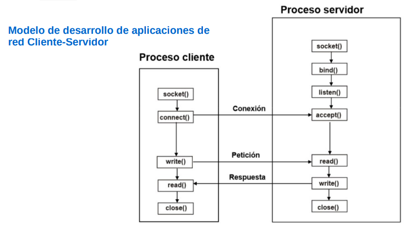

# Proyecto: Servidores de Comandos

Este proyecto se basa en el desarrollo y configuración de un sistema cliente-servidor donde los clientes, implementados en Python y C++ en una máquina virtual con Windows, se comunican con servidores en una máquina virtual con Linux. Los servidores ejecutan comandos en Linux recibidos de los clientes y devuelven las respuestas. La comunicación entre clientes y servidores se realiza mediante sockets. 

## Estructura del Proyecto

### 1. Maquinas Virtuales

- **Cliente (Windows)**
  - Implementaciones en Python y C++.
- **Servidor (Linux)**
  - Servidores configurados para diferentes modelos de procesamiento:
    - Secuencial
    - Procesos pesados
    - Hilos dinámicos
    - Hilos estáticos

### 2. Configuración de la Red

Las máquinas virtuales están conectadas en una red interna configurada con IPs específicas para garantizar la comunicación.

## Descripción de los Servidores

### Servidor Secuencial

Este servidor maneja una conexión a la vez, procesando cada solicitud de cliente de manera secuencial.

### Servidor de Procesos Pesados

Este servidor crea un nuevo proceso para manejar cada solicitud del cliente.

### Servidor de Hilos Dinámicos - Estáticos (cantidad definida de hilos)

Este servidor crea un nuevo hilo para manejar cada solicitud del cliente.

## Uso del Sistema

1. Iniciar el servidor en la máquina Linux.
2. Iniciar el cliente en la máquina Windows.
3. Ejecutar el servidor 
4. Ejecutar el o los clientes.

#### Referencias
https://www.youtube.com/watch?v=Qj6B4pYnH1g
https://www.youtube.com/watch?v=FGF_lm7tgLA
https://www.youtube.com/watch?v=gzSfxqQtD0I
